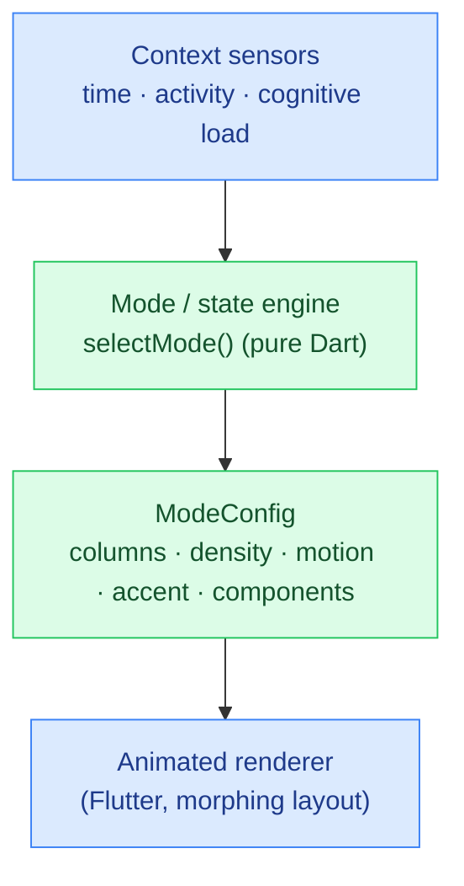

# MorphUI

**▶ Live demo: https://parag-labs.github.io/morph-ui/** — a Flutter app running on the web (also
runs natively via `flutter run`). Everything is on-device; no backend, no API keys.

A **real-time generative interface engine**. Most "generative UI" is one-shot; MorphUI is
continuous: the interface has **no fixed screens**, only adaptive surfaces that re-design
themselves — layout, density, component set, motion, and accent all morph in real time as your
context changes.

Drag the time and cognitive-load sliders or pick an activity and watch the home surface
transform smoothly between **Deep Work**, **Browse**, **Quick Action**, **Discover**, and
**Wind Down**.

---

## Why

Continuous, elegant, real-time morphing is still rare and extremely impressive in a demo. The
hard part isn't the animation — it's making the mode selection feel *intelligent* and the modes
feel *meaningfully different*. MorphUI puts that logic in a deterministic, testable core.

## Core idea

```
Context (time, activity, cognitive load)  →  mode selection  →  layout config  →  morphing surface
                (deterministic)               (5 distinct modes)   (columns, density, motion, accent)
```

The **mode/state engine** (`lib/core/morph_engine.dart`) is pure Dart with no Flutter imports.
`selectMode(context)` is total and deterministic — every context maps to exactly one mode — and
each mode carries a full `ModeConfig` (column count, density, motion, accent, and component set).
The Flutter layer just animates between whatever config the engine returns.

## Architecture



## The five modes

| Mode | Feels like | Columns | Density |
|------|-----------|---------|---------|
| Deep Work | focused, one thing at a time | 1 | low |
| Browse | comfortable reading | 2 | medium |
| Quick Action | big thumb-sized shortcuts | 2 | medium |
| Discover | dense and exploratory | 3 | high |
| Wind Down | calm, minimal, low motion | 1 | very low |

The modes differ in structure, not just colour — column count, spacing, font scale, motion
intensity, and which components appear all change, so a morph is a genuine re-design.

## Demo

```bash
flutter run -d chrome     # web
flutter run               # a connected device / simulator
```

## Design decisions

- **Deterministic mode selection.** Which mode for which context is rules, not randomness, so
  switching "feels intelligent, not random" and is unit-testable.
- **Structural morphing.** The layout re-flows (columns, density, component set) via
  `AnimatedContainer` / `AnimatedSize` / `AnimatedSwitcher`, so transitions are smooth (< 500ms)
  and modes are meaningfully distinct.
- **Config-driven UI.** The renderer contains no mode logic; it just draws the `ModeConfig` the
  engine hands it, which keeps the engine reusable.

## Testing

`flutter test` — 10 tests: mode selection for every activity/time/load combination (totality),
determinism, and that each mode's config is distinct (Deep Work sparse, Discover dense).

```bash
flutter test
```

## Roadmap

- Real context signals (usage patterns, optional biometrics) feeding `MorphContext`.
- An auto-cycle that morphs through a day.
- More modes and user-tunable mode preferences.

## Layout

```
morph-ui/
├── lib/
│   ├── core/morph_engine.dart   # pure Dart: MorphContext → UiMode → ModeConfig (unit-tested)
│   └── main.dart                # the morphing surface + context controls
├── test/                        # 10 flutter_test unit tests
└── web/
```

## License

MIT — see [LICENSE](LICENSE).
